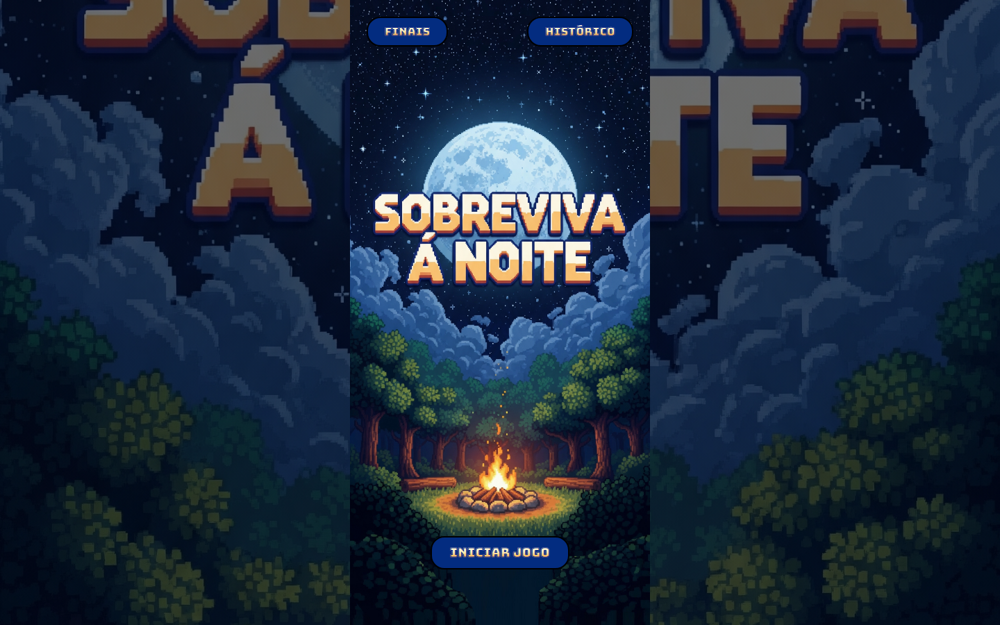
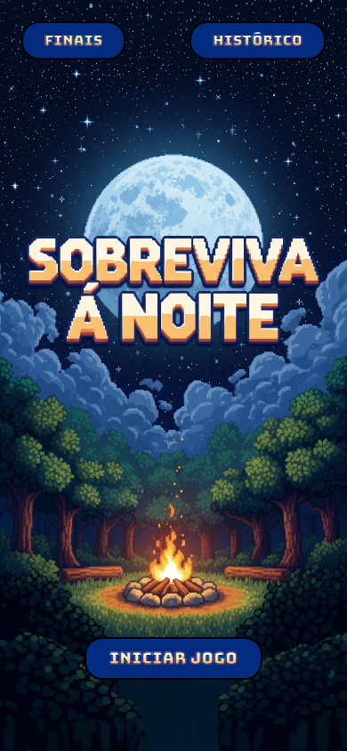
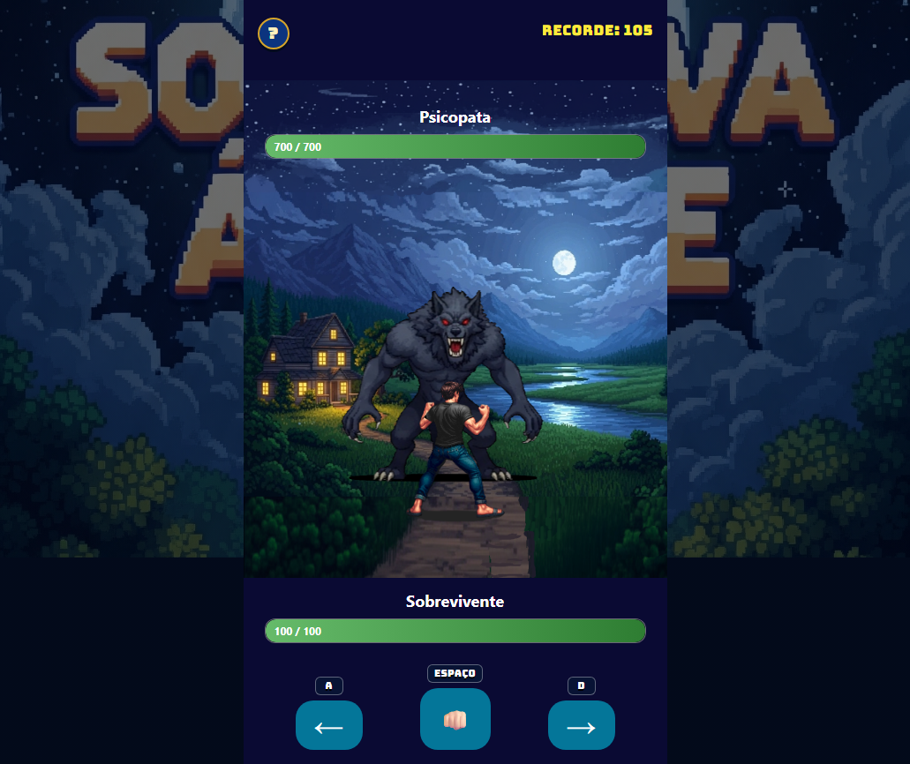
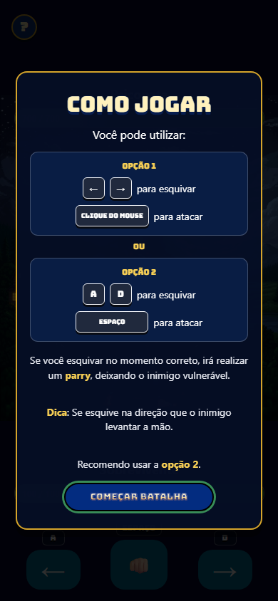
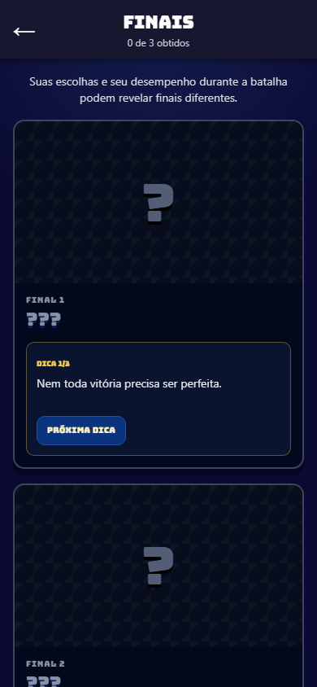
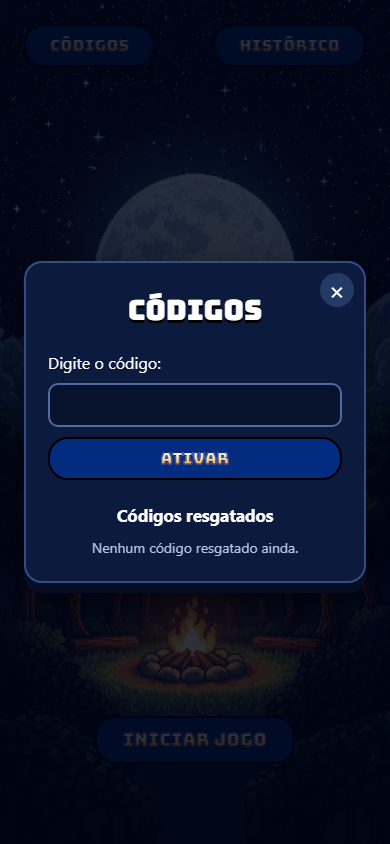
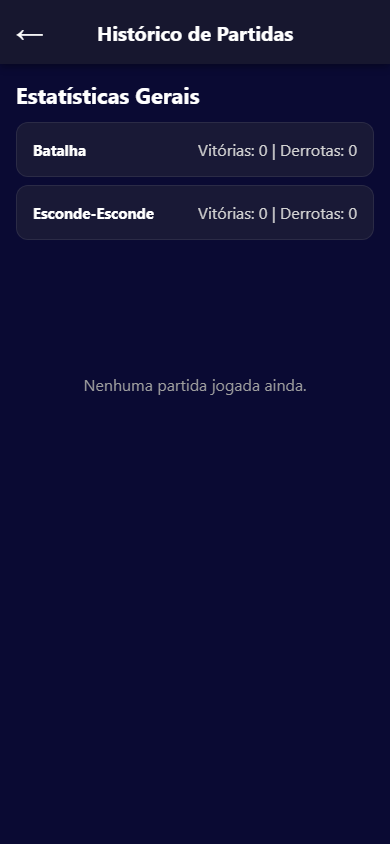

# Produto — Sobreviva à Noite

Esta página apresenta o jogo, suas mecânicas e suas principais telas. As capturas foram selecionadas para demonstrar a experiência sem revelar cenas ou artes dos finais.

Para estratégia de testes, cobertura e evidências automatizadas, consulte a [documentação de qualidade](./QUALIDADE.md).

## Visão do produto

**Sobreviva à Noite** é um jogo de suspense, sorte e reflexos disponível para Android e navegador. Depois da introdução narrativa, o jogador escolhe entre duas formas de sobreviver: esconder-se dentro da casa ou enfrentar diretamente o monstro.

| Plataforma | Experiência |
|---|---|
| Android | Aplicativo nativo desenvolvido em Kotlin e Jetpack Compose |
| Web/PWA | Versão React e TypeScript, instalável e disponível offline após o primeiro carregamento |

## Entrada no jogo

A abertura e o menu preservam a mesma identidade visual em computador e celular. A história apresenta o cenário antes da escolha do modo.

  
  

## Mecânicas

### Esconde-Esconde

O jogador recebe poucos segundos para escolher um dos seis esconderijos. Em seguida, acompanha a busca do monstro pela casa e descobre se o local escolhido foi seguro.

- seleção sob pressão de tempo;
- esconderijos e percurso do monstro apresentados sobre a planta da casa;
- sorteios que variam cada partida;
- tensão, passos, vozes e efeitos sonoros;
- vitória ou derrota registrada no histórico.

  

### Batalha

Na batalha, o jogador ataca, observa a direção do golpe inimigo e escolhe o momento de esquivar. Ataques consecutivos formam combos e atualizam o recorde persistente.

| Ação | Tela ou mouse | Teclado |
|---|---|---|
| Esquivar para a esquerda | Botão `←` | `A` ou `←` |
| Atacar | Punho ou clique na área livre | `Espaço` |
| Esquivar para a direita | Botão `→` | `D` ou `→` |

#### Parry

Quando a esquiva é realizada na direção correta durante a janela exata do ataque, ocorre um **parry**. O monstro fica atordoado temporariamente e recebe golpes mais fortes enquanto estiver vulnerável.

| Combate | Parry executado no jogo |
|:---:|:---:|
|  |  |

O tutorial aparece automaticamente na primeira batalha e pode ser reaberto pelo botão **?**.

  

## Progressão sem spoilers

O jogo mantém dados no próprio dispositivo para que a evolução continue entre sessões:

- recorde de combo;
- histórico de partidas dos dois modos;
- códigos e recompensas desbloqueáveis;
- galeria de finais obtidos;
- dicas progressivas para finais ainda bloqueados.

| Galeria bloqueada | Códigos | Histórico |
|:---:|:---:|:---:|
|  |  |  |

Nenhuma imagem pública desta documentação mostra a conclusão narrativa ou a arte dos finais desbloqueáveis.

## Recursos da versão Web

- layout proporcional para celular e computador;
- controles por toque, teclado e mouse;
- instalação como PWA;
- funcionamento offline após o primeiro carregamento;
- carregamento antecipado de imagens e áudios de cada etapa;
- persistência local sem necessidade de cadastro.

## Executar o produto

- [Instruções gerais no README](./README.md#executar-localmente)
- [Guia completo da versão Web](./JogoWeb/README.md)
- [Como executar e publicar a Web/PWA](./JogoWeb/COMO_EXECUTAR.md)

## Documentação relacionada

- [Qualidade e evidências](./QUALIDADE.md)
- [Arquitetura Web](./JogoWeb/ARQUITETURA.md)
- [Matriz de equivalência Android/Web](./JogoWeb/MATRIZ_EQUIVALENCIA.md)
