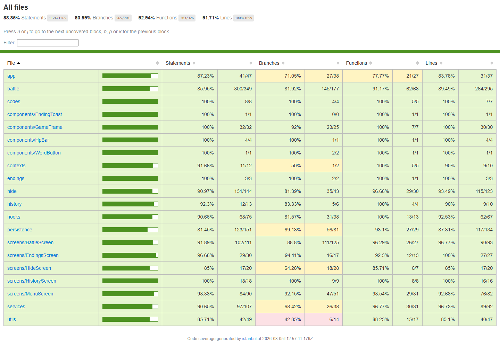
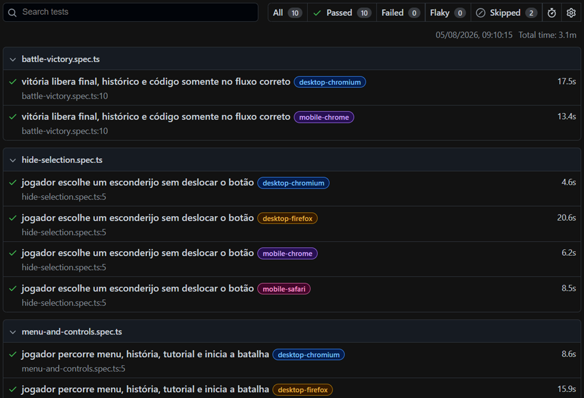
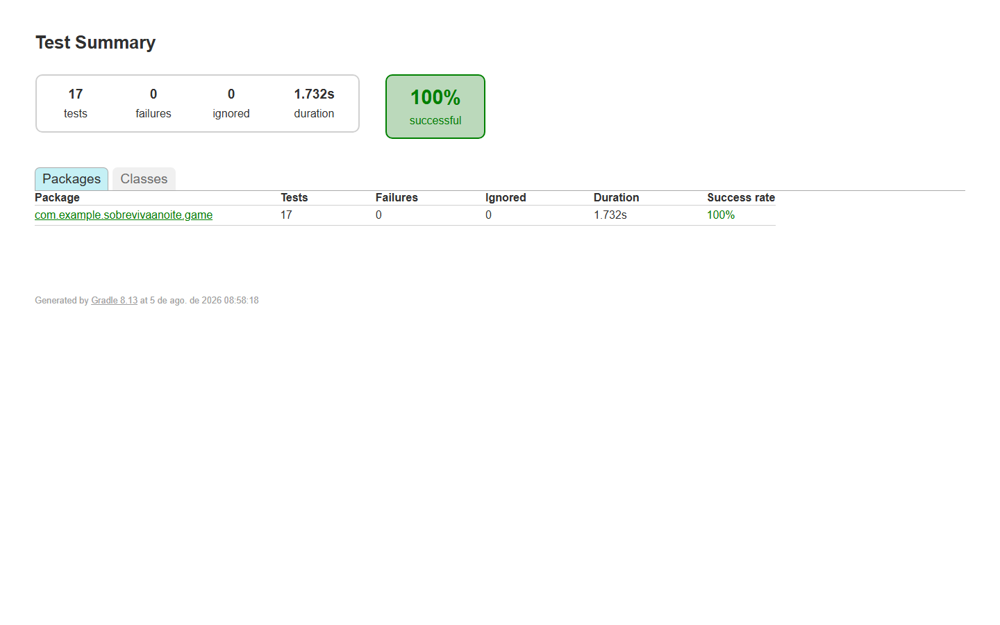
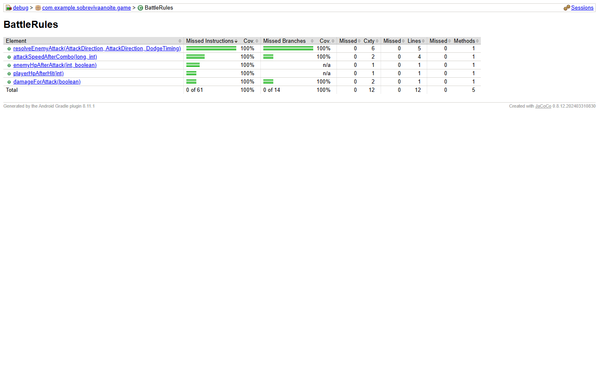
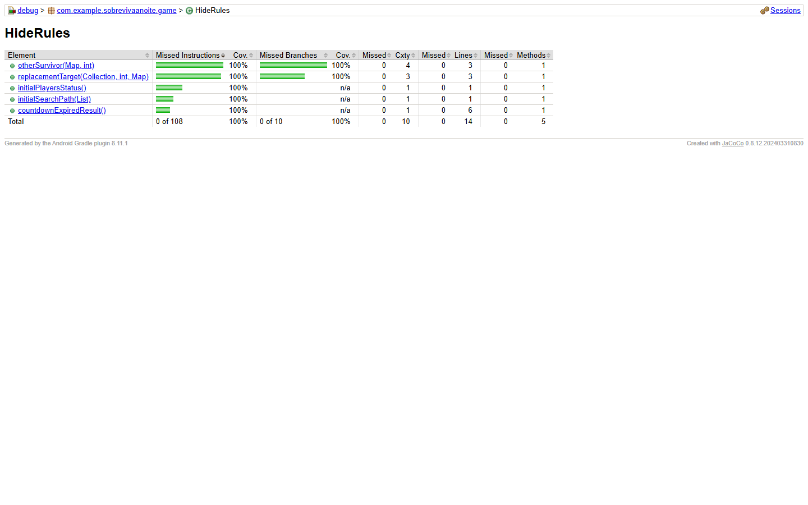

# Qualidade — Sobreviva à Noite

Esta página reúne a estratégia, os resultados e as evidências reproduzíveis de qualidade. As funcionalidades e capturas de gameplay ficam separadas na [documentação do produto](./PRODUTO.md).

Resultados registrados em **5 de agosto de 2026** na branch `feat/web`.

## Resumo executivo

| Validação | Resultado registrado |
|---|---|
| Vitest | 104 testes aprovados em 20 arquivos |
| Cobertura Web/V8 | 88,85% statements, 80,59% branches, 92,94% funções e 91,71% linhas |
| Playwright | 10 execuções aprovadas em quatro perfis e 2 skips intencionais |
| Validação visual/estrutural | 26 cenários aprovados no Chrome |
| PWA | abertura, esconderijo, batalha, histórico, galeria e áudios aprovados offline |
| Android/JUnit | 17 testes aprovados, sem falhas ou ignorados |
| Android instrumentado | 10 testes implementados e compilados; execução em dispositivo ainda pendente |

## Estratégia de QA

| Camada | Ferramentas e objetivo |
|---|---|
| Regras de negócio | Vitest e JUnit para batalha, esconderijo, finais, códigos e persistência |
| Componentes e integração | Testing Library para telas, modais, controles, foco e navegação |
| Cobertura Web | `@vitest/coverage-v8`, com limites mínimos obrigatórios |
| Jornadas de usuário | Playwright em navegadores desktop e perfis móveis emulados |
| Validação visual | Puppeteer e Chrome em diferentes viewports e escalas |
| PWA | Fluxos online/offline, cache, rotas, imagens e áudios |
| Integração contínua | GitHub Actions em pushes e pull requests |

## Web: Vitest e cobertura V8

Comando reproduzível:

```powershell
cd JogoWeb
npm run test:coverage
```

Os testes cobrem regras, hooks, persistência, telas, acessibilidade, áudio e integrações. Os limites obrigatórios são 85% de statements, 75% de branches, 85% de funções e 88% de linhas.



O relatório Web utiliza o mecanismo **V8** integrado ao Vitest. O JaCoCo permanece reservado à cobertura das regras Java/Kotlin executadas na JVM.

## Web: jornadas E2E com Playwright

Comando reproduzível:

```powershell
cd JogoWeb
npm run test:e2e
```

A matriz percorre Chrome e Firefox no desktop, além de Chrome e Safari emulados em perfis móveis. Os fluxos verificam menu, lore, tutorial, controles, esconderijo, vitória, histórico, galeria e códigos.



Os dois skips são intencionais: a jornada longa de vitória roda no Chromium desktop e mobile, enquanto Firefox e Safari recebem os smoke tests de menu/controles e esconderijo. Essa divisão reduz o tempo da matriz sem deixar os outros motores sem cobertura.

## Android: JUnit e JaCoCo

### Testes unitários

```powershell
.\gradlew.bat :app:testDebugUnitTest
```



### Cobertura das regras

```powershell
.\gradlew.bat :app:createDebugUnitTestCoverageReport
```

A cobertura de 100% abaixo pertence especificamente às classes puras extraídas para as regras de batalha e esconderijo. Ela não representa a cobertura global do aplicativo Android.

| Regras da batalha | Regras do esconderijo |
|:---:|:---:|
|  |  |

## Gates automatizados

| Gate | Comando | Resultado |
|---|---|:---:|
| ESLint | `npm run lint` | Aprovado |
| TypeScript estrito | `npm run typecheck` | Aprovado |
| Build de produção | `npm run build` | Aprovado |
| 26 cenários visuais/estruturais | `npm run visual:check` | Aprovado |
| PWA offline | `npm run pwa:check` | Aprovado |
| Compilação dos instrumentados Android | `.\gradlew.bat :app:assembleDebugAndroidTest` | Aprovado |

As auditorias visual e PWA permanecem como gates automatizados, mas não recebem capturas próprias: uma imagem da mensagem do terminal acrescentaria pouca informação comparada ao comando reproduzível e ao resultado da pipeline.

## Limitações declaradas

- emulação mobile do Playwright não substitui testes em dispositivos físicos;
- a validação visual atual verifica estrutura, overflow, imagens e estados, mas não compara pixels contra baselines;
- os 10 testes instrumentados Android precisam ser executados em emulador ou aparelho antes de serem apresentados como aprovados;
- cobertura demonstra código exercitado, não ausência de defeitos;
- capturas representam uma execução registrada e devem ser atualizadas quando os resultados mudarem.

## Como reproduzir

| Objetivo | Documento |
|---|---|
| Estratégia e critérios | [ESTRATEGIA_QA.md](./ESTRATEGIA_QA.md) |
| Playwright | [JogoWeb/TESTES_E2E.md](./JogoWeb/TESTES_E2E.md) |
| Android | [TESTES_ANDROID.md](./TESTES_ANDROID.md) |
| Comandos Web | [JogoWeb/README.md](./JogoWeb/README.md#testes) |

## Evidências versionadas

- [Catálogo de evidências](./docs/evidencias/README.md)
- [Evidências Web e Android](./docs/evidencias/qa/README.md)
