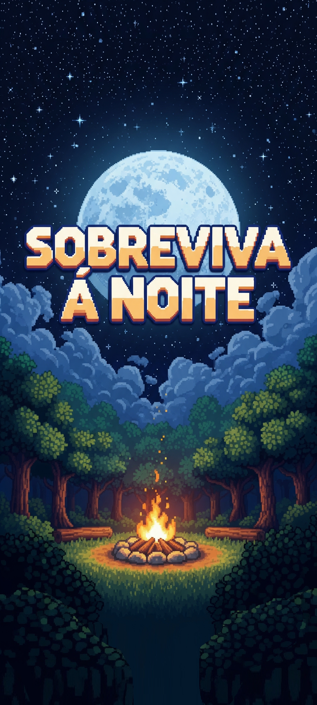
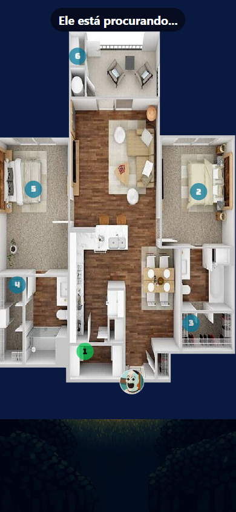
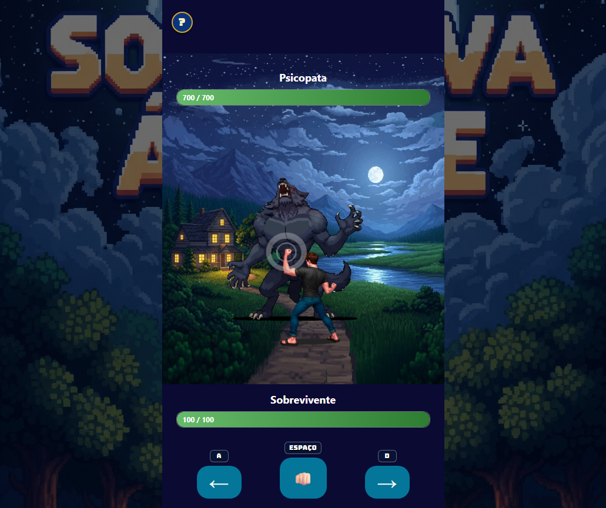

<div align="center">



# 🌙 Sobreviva à Noite

**Um jogo de suspense, sorte e reflexos para Android e navegador.**


[](https://github.com/CarlosRyan07/SobrevivaANoite/actions/workflows/web-quality.yml)


[Visão geral](#visão-geral) • [Produto](./PRODUTO.md) • [Qualidade](./QUALIDADE.md) • [O jogo](#o-jogo) • [Executar](#executar-localmente) • [Documentação](#documentação)

</div>

---

## Visão geral

**Sobreviva à Noite** nasceu como um projeto acadêmico Android e evoluiu para um jogo completo com duas formas de sobreviver: esconder-se dentro da casa ou enfrentar o monstro em uma batalha baseada em tempo de reação.

O mesmo jogo também está disponível como uma aplicação Web instalável. A versão Web preserva a identidade, as regras, as imagens e os sons do Android, acrescentando controles de teclado e mouse, funcionamento offline e layouts adaptados para celular e computador.

| Versão | Tecnologias | Estado |
|---|---|:---:|
| Android | Kotlin, Jetpack Compose, Room e DataStore | ✅ Completa |
| Web/PWA | React, TypeScript, Vite e Service Worker | ✅ Completa |

> A publicação do jogo na internet será adicionada aqui após a escolha da hospedagem. Enquanto isso, as duas versões podem ser executadas localmente.

## Documentação principal

O conteúdo detalhado foi separado por finalidade para facilitar a leitura:

| Produto | Qualidade |
|---|---|
| [Mecânicas, controles, plataformas e capturas sem spoilers](./PRODUTO.md) | [Estratégia de QA, testes, cobertura, CI e evidências reproduzíveis](./QUALIDADE.md) |

O README permanece como apresentação geral. Quem deseja conhecer o jogo pode seguir pela documentação do produto; quem deseja avaliar a engenharia e o trabalho de QA pode acessar diretamente a documentação de qualidade.

## O jogo

O jogador conhece a história e escolhe entre duas experiências: encontrar um esconderijo antes que o tempo acabe ou enfrentar o monstro em uma batalha de ataques, esquivas, combos e parries.

<div align="center">

| Abertura | Esconde-Esconde | Batalha |
|:---:|:---:|:---:|
|  |  |  |

</div>

Controles, mecânicas, progressão e a galeria completa de capturas sem spoilers estão em [PRODUTO.md](./PRODUTO.md).

## Executar localmente

### Web/PWA

Requisitos: Git e Node.js `^20.19.0` ou `>=22.12.0`.

```bash
git clone https://github.com/CarlosRyan07/SobrevivaANoite.git
cd SobrevivaANoite/JogoWeb
npm ci
npm run dev
```

Abra o endereço mostrado pelo Vite, normalmente `http://localhost:5173`.

Para gerar a versão pronta para hospedagem:

```bash
npm run build
npm run preview
```

O build final é criado em `JogoWeb/dist/`. Consulte o [guia completo da versão Web](./JogoWeb/README.md) para testes e publicação.

### Android

Abra o repositório no Android Studio ou execute:

```bash
git clone https://github.com/CarlosRyan07/SobrevivaANoite.git
cd SobrevivaANoite
./gradlew installDebug
```

No Windows PowerShell, use `./gradlew.bat installDebug`.

## Estrutura do repositório

```text
SobrevivaANoite/
├── app/                  # Aplicativo Android em Kotlin
├── docs/evidencias/      # Capturas separadas entre produto e QA
├── JogoWeb/              # Aplicação React/TypeScript/PWA
│   ├── public/           # Imagens, áudios, GIF e ícones
│   ├── e2e/              # Jornadas críticas com Playwright
│   ├── scripts/          # Otimização e testes em navegador
│   ├── src/              # Telas, regras, persistência e testes
│   └── README.md         # Guia técnico da versão Web
├── gradle/               # Configuração do Android
├── PRODUTO.md            # Mecânicas, controles e capturas
├── QUALIDADE.md          # Testes, cobertura, CI e evidências
└── README.md             # Apresentação e navegação principal
```

## Documentação

- [Produto, mecânicas e capturas](./PRODUTO.md)
- [Qualidade, testes e evidências](./QUALIDADE.md)
- [Estratégia de qualidade](./ESTRATEGIA_QA.md)
- [Testes Android](./TESTES_ANDROID.md)
- [Guia da versão Web](./JogoWeb/README.md)
- [Como executar e publicar](./JogoWeb/COMO_EXECUTAR.md)
- [Testes E2E com Playwright](./JogoWeb/TESTES_E2E.md)
- [Arquitetura Web](./JogoWeb/ARQUITETURA.md)
- [Histórico da migração](./JogoWeb/MIGRACAO.md)
- [Matriz de equivalência Android/Web](./JogoWeb/MATRIZ_EQUIVALENCIA.md)
- [Status atual](./JogoWeb/STATUS.md)

## Origem acadêmica

O projeto começou na disciplina de **Programação para Dispositivos Móveis**, explorando Jetpack Compose, navegação, gerenciamento de estado, persistência local e mecânicas interativas. A migração para a Web ampliou o trabalho com React, TypeScript, PWA, acessibilidade e testes reais em navegador.

## Autor

<div align="center">

[<br /><strong>Carlos Ryan</strong>](https://github.com/CarlosRyan07)

Desenvolvimento, conceito e evolução do projeto.

⭐ Se você gostou do jogo, considere deixar uma estrela no repositório.

</div>
