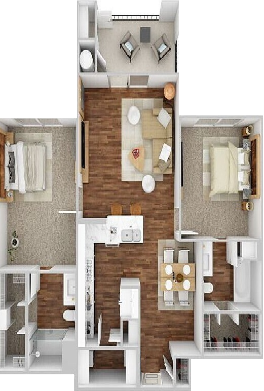

<div align="center">


# 🌙 Sobreviva à Noite

**Um jogo de suspense, sorte e reflexos para Android e navegador.**


[](https://github.com/CarlosRyan07/SobrevivaANoite/actions/workflows/web-quality.yml)


[Visão geral](#visão-geral) • [Qualidade e testes](#qualidade-e-testes) • [Modos de jogo](#modos-de-jogo) • [Como jogar](#como-jogar) • [Executar](#executar-localmente) • [Documentação](#documentação)

</div>

---

## Visão geral

**Sobreviva à Noite** nasceu como um projeto acadêmico Android e evoluiu para um jogo completo com duas formas de sobreviver: esconder-se dentro da casa ou enfrentar o monstro em uma batalha baseada em tempo de reação.

O mesmo jogo também está disponível como uma aplicação Web instalável. A versão Web preserva a identidade, as regras, as imagens e os sons do Android, acrescentando controles de teclado e mouse, funcionamento offline e layouts adaptados para celular e computador.

| Versão | Tecnologias | Estado |
|---|---|:---:|
| Android | Kotlin, Jetpack Compose, Room e DataStore | ✅ Completa |
| Web/PWA | React, TypeScript, Vite e Service Worker | ✅ Completa |

> A publicação do jogo na internet será adicionada aqui após a escolha da hospedagem. Enquanto isso, as duas versões podem ser executadas localmente.

## Qualidade e testes

A qualidade é parte central do projeto. A versão Web combina testes de regras, componentes, integração, fluxos reais no navegador, persistência e funcionamento offline.

### Resultados atuais

| Indicador | Resultado |
|---|:---:|
| Testes automatizados | **104** testes em 20 arquivos ✅ |
| Jornadas E2E | **10** execuções aprovadas em 4 perfis de navegador ✅ |
| Cenários reais no Chrome | **26** cenários visuais e interativos ✅ |
| Statements | **88,85%** |
| Branches | **80,59%** |
| Funções | **92,94%** |
| Linhas | **91,71%** |
| TypeScript estrito, ESLint e build | Aprovados ✅ |
| Telas, imagens e áudios offline | Aprovados ✅ |

### Estratégia de QA

| Camada | Ferramentas e cobertura |
|---|---|
| Regras de negócio | Vitest: batalha, esconderijo, finais, códigos e persistência |
| Componentes e integração | Testing Library: telas, modais, controles, foco e navegação |
| Cobertura de código | `@vitest/coverage-v8`, com limites mínimos obrigatórios |
| Jornadas de usuário | Playwright: menu, tutorial, controles, esconderijo, vitória, histórico, finais e códigos |
| Testes visuais | Puppeteer + Chrome em diferentes viewports e escalas |
| PWA | Fluxos online/offline, cache, imagens, rotas e áudios |
| Integração contínua | GitHub Actions em pushes e pull requests |

### Como a cobertura é calculada

```bash
cd JogoWeb
npm run test:coverage
```

A cobertura Web é coletada pelo mecanismo **V8** por meio do pacote `@vitest/coverage-v8`. O comando apresenta o resumo no terminal e gera relatórios em `JogoWeb/coverage/`, incluindo uma página HTML navegável.

Os limites configurados são 85% de statements, 75% de branches, 85% de funções e 88% de linhas. Se algum valor ficar abaixo do limite, o comando falha e o GitHub Actions bloqueia a validação do PR.

> **Não usamos JaCoCo para esses números.** JaCoCo é voltado à cobertura de aplicações Java/Kotlin na JVM. Como esta cobertura pertence à versão React/TypeScript, usamos a instrumentação nativa do V8 integrada ao Vitest.

### Evidências selecionadas

| Cobertura Web com Vitest/V8 | Jornadas reais com Playwright |
|:---:|:---:|
|  |  |

Consulte as [evidências completas de qualidade e funcionalidades](./EVIDENCIAS_QA.md), com contexto, comandos reproduzíveis e limitações declaradas.

## Modos de jogo

### 🫣 Esconde-Esconde

Você tem poucos segundos para escolher um dos seis esconderijos. Depois disso, resta acompanhar o monstro percorrendo a casa e torcer para que ele não encontre você.

- escolha sob pressão;
- percurso e sobreviventes sorteados a cada partida;
- personagens, tensão, passos e efeitos sonoros;
- histórico persistente de vitórias e derrotas.

### ⚔️ Batalha

Quando fugir não é uma opção, lute. Ataque o monstro, observe a direção dos golpes e esquive no instante certo para executar um **parry**.

- ataques, esquivas, parry e combos;
- recorde persistente;
- tutorial de controles dentro do jogo;
- três finais condicionais;
- códigos desbloqueáveis e galeria de finais.

## Imagens do jogo

<div align="center">

| Abertura | Esconde-Esconde | Batalha |
|:---:|:---:|:---:|
|  |  |  |

</div>

## Principais recursos

- 🎮 dois modos com mecânicas diferentes;
- 📖 lore completa antes da escolha do modo;
- 🏆 três finais: **A Maldição do Pidão**, **Venceu na Raça** e **Sopa de Lobo**;
- 🔐 sistema de códigos e recompensas desbloqueáveis;
- 🌳 galeria persistente de finais, com dicas para os ainda bloqueados;
- 📊 histórico de partidas e recorde de combo;
- 🔊 trilha, vozes e efeitos sonoros sobrepostos;
- ⌨️ controles por toque, teclado e mouse;
- 📱 palco proporcional em celular e desktop;
- 📦 instalação como PWA;
- 📴 funcionamento offline após o primeiro carregamento.

## Como jogar

### Esconde-Esconde

1. Entre na casa escolhendo **Esconder**.
2. Selecione um dos seis locais antes do contador terminar.
3. Acompanhe a busca do monstro.
4. Sobreviva e tente descobrir todos os resultados.

### Batalha

| Ação | Tela/toque | Teclado |
|---|---|---|
| Esquivar para a esquerda | Botão `←` | `A` ou `←` |
| Atacar | Botão de punho ou clique na tela | `Espaço` |
| Esquivar para a direita | Botão `→` | `D` ou `→` |

Esquivar na direção correta durante o ataque realiza um **parry**, atordoa o inimigo e abre uma janela segura para atacar.

## Executar localmente

### Web/PWA

Requisitos: Git e Node.js `^20.19.0` ou `>=22.12.0`.

```bash
git clone https://github.com/CarlosRyan07/SobrevivaANoite.git
cd SobrevivaANoite/JogoWeb
npm ci
npm run dev
```

Abra o endereço mostrado pelo Vite, normalmente `http://localhost:5173`.

Para gerar a versão pronta para hospedagem:

```bash
npm run build
npm run preview
```

O build final é criado em `JogoWeb/dist/`. Consulte o [guia completo da versão Web](./JogoWeb/README.md) para testes e publicação.

### Android

Abra o repositório no Android Studio ou execute:

```bash
git clone https://github.com/CarlosRyan07/SobrevivaANoite.git
cd SobrevivaANoite
./gradlew installDebug
```

No Windows PowerShell, use `./gradlew.bat installDebug`.

## Estrutura do repositório

```text
SobrevivaANoite/
├── app/                  # Aplicativo Android em Kotlin
├── JogoWeb/              # Aplicação React/TypeScript/PWA
│   ├── public/           # Imagens, áudios, GIF e ícones
│   ├── e2e/              # Jornadas críticas com Playwright
│   ├── scripts/          # Otimização e testes em navegador
│   ├── src/              # Telas, regras, persistência e testes
│   └── README.md         # Guia técnico da versão Web
├── gradle/               # Configuração do Android
└── README.md             # Apresentação geral do projeto
```

## Documentação

- [Estratégia de qualidade](./ESTRATEGIA_QA.md)
- [Evidências de qualidade e funcionalidades](./EVIDENCIAS_QA.md)
- [Testes Android](./TESTES_ANDROID.md)
- [Guia da versão Web](./JogoWeb/README.md)
- [Como executar e publicar](./JogoWeb/COMO_EXECUTAR.md)
- [Testes E2E com Playwright](./JogoWeb/TESTES_E2E.md)
- [Arquitetura Web](./JogoWeb/ARQUITETURA.md)
- [Histórico da migração](./JogoWeb/MIGRACAO.md)
- [Matriz de equivalência Android/Web](./JogoWeb/MATRIZ_EQUIVALENCIA.md)
- [Status atual](./JogoWeb/STATUS.md)

## Origem acadêmica

O projeto começou na disciplina de **Programação para Dispositivos Móveis**, explorando Jetpack Compose, navegação, gerenciamento de estado, persistência local e mecânicas interativas. A migração para a Web ampliou o trabalho com React, TypeScript, PWA, acessibilidade e testes reais em navegador.

## Autor

<div align="center">

[<br /><strong>Carlos Ryan</strong>](https://github.com/CarlosRyan07)

Desenvolvimento, conceito e evolução do projeto.

⭐ Se você gostou do jogo, considere deixar uma estrela no repositório.

</div>
